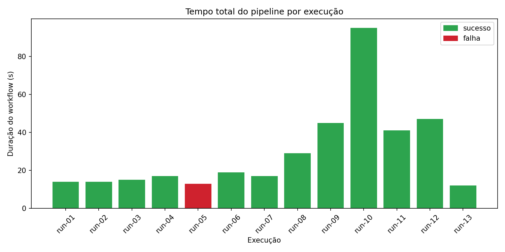
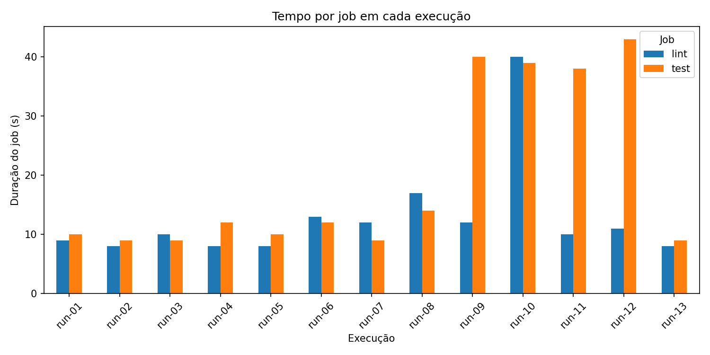
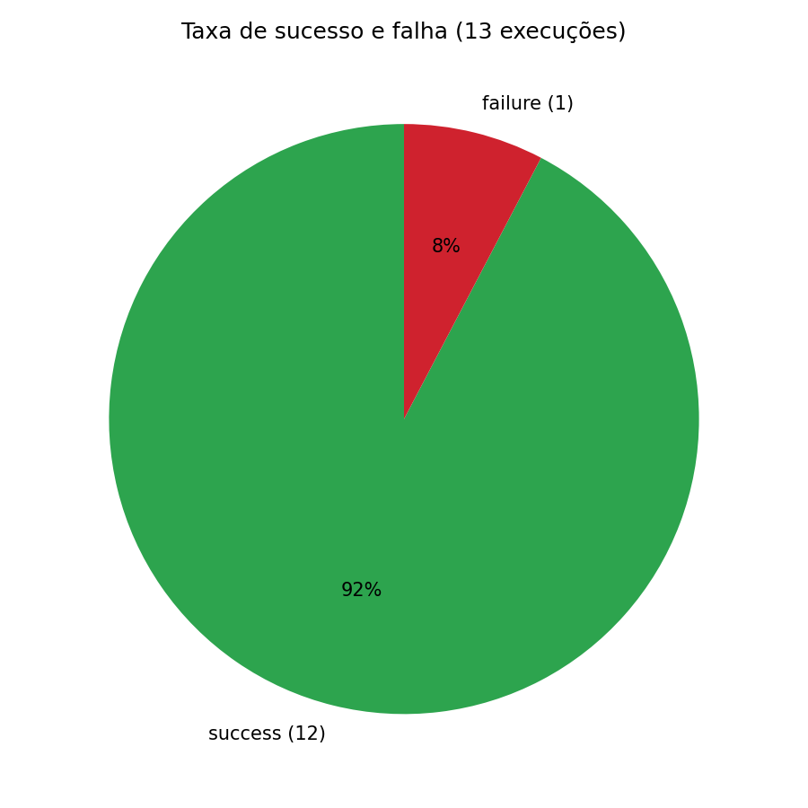
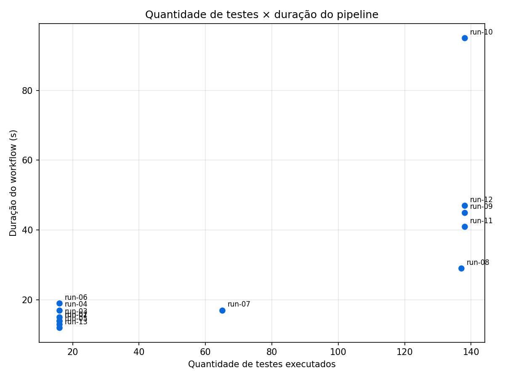
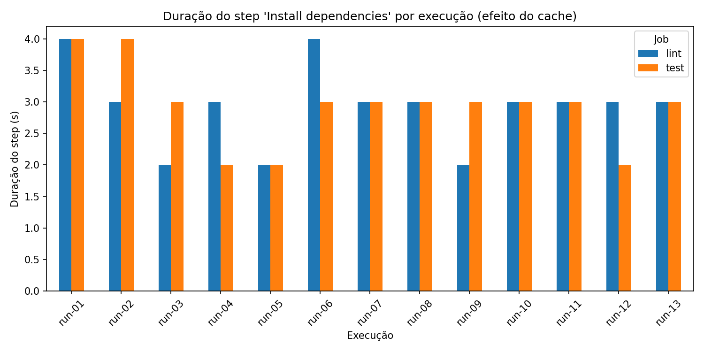
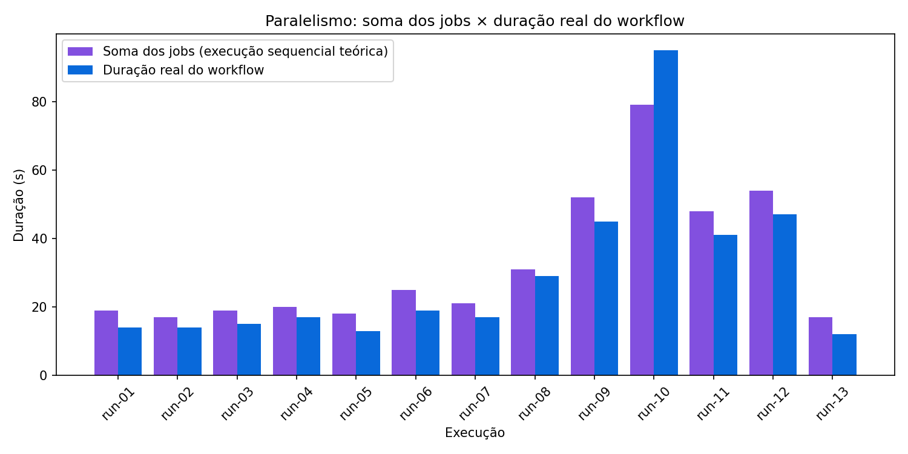

# Relatório — Métricas de Pipeline CI/CD no GitHub Actions

**Aluno:** Lucas Matheus Nunes
**Repositório:** <https://github.com/lucas-nunes-matheus/cicd-pipelines-metrics>
**Workflow:** [`.github/workflows/ci.yml`](../.github/workflows/ci.yml)
**Período do experimento:** 10/06/2026 (13 execuções reais)

> As seções 1–2 (contexto e hipóteses) foram escritas e commitadas **antes** da primeira
> execução (commit `a89386f`, run-01) — o histórico git comprova que as hipóteses foram
> formuladas a priori.

## 1. Contexto e objetivo

Este experimento instrumenta um pipeline CI/CD no GitHub Actions para medir, com dados
reais de execução, o desempenho, a estabilidade e os gargalos do processo. O pipeline
roda lint (ruff) e testes (pytest) sobre um módulo Python pequeno, foi executado 13 vezes
com variações controladas (cache, falhas, volume de testes, teste lento, paralelismo) e
teve suas métricas coletadas via API REST do GitHub por script Python próprio
([`scripts/collect_metrics.py`](../scripts/collect_metrics.py)).

## 2. Hipóteses iniciais

Formuladas antes de qualquer execução; confrontadas com os dados na seção 7.

- **H1 (cache):** habilitar `cache: pip` reduzirá a duração do step `Install dependencies`
  em mais de 50% nos runs com cache hit, em comparação aos runs sem cache.
- **H2 (paralelismo):** com jobs paralelos, o tempo total do workflow será próximo ao do
  job mais lento (`test`); com `needs: lint`, o tempo total será aproximadamente a soma
  dos dois jobs — ou seja, o paralelismo economiza ~tempo do job `lint`.
- **H3 (volume de testes):** aumentar a quantidade de testes de ~16 para ~120 terá impacto
  pequeno (< 10%) na duração total, pois o overhead fixo (provisionar runner, checkout,
  setup Python, instalar dependências) domina o tempo do pipeline.
- **H4 (gargalo):** o step mais caro do pipeline, sem cache, será `Install dependencies`.
- **H5 (teste lento):** um único teste com `time.sleep(30)` aumentará a duração total em
  ~30 s, tornando-se o maior contribuinte individual do job `test`.

## 3. Metodologia

### 3.1 Projeto-alvo e pipeline

O projeto-alvo é o módulo [`src/calculadora`](../src/calculadora/operacoes.py)
(8 funções puras) com 16 testes pytest no estado baseline. O pipeline
([`ci.yml`](../.github/workflows/ci.yml)) tem dois jobs:

- **lint:** checkout → setup Python 3.12 → `pip install -r requirements.txt` → `ruff check .`
- **test:** checkout → setup Python 3.12 → install → `pytest --json-report` → upload do
  artifact `test-report` (com `if: always()`, para capturar métricas mesmo em falha)

Dois pontos de variação controlada: `cache: pip` no `actions/setup-python`
(ligado a partir do run-03) e `needs: lint` no job `test` (sequencial apenas no run-10).

### 3.2 Tabela de execuções

Cada execução corresponde a exatamente um commit com uma única variação:

| Run | Run ID (link) | Commit | Status | Total (s) | Variação |
|---|---|---|---|---|---|
| run-01 | [27306176271](https://github.com/lucas-nunes-matheus/cicd-pipelines-metrics/actions/runs/27306176271) | `a89386f` | success | 14 | Baseline (sem cache, paralelo, 16 testes) |
| run-02 | [27307336491](https://github.com/lucas-nunes-matheus/cicd-pipelines-metrics/actions/runs/27307336491) | `c8e6392` | success | 14 | Repetição do baseline (variância) |
| run-03 | [27307722430](https://github.com/lucas-nunes-matheus/cicd-pipelines-metrics/actions/runs/27307722430) | `830c4e2` | success | 15 | Cache pip habilitado (cold/miss) |
| run-04 | [27307871395](https://github.com/lucas-nunes-matheus/cicd-pipelines-metrics/actions/runs/27307871395) | `1d17c8e` | success | 17 | Cache quente (hit) |
| run-05 | [27307988407](https://github.com/lucas-nunes-matheus/cicd-pipelines-metrics/actions/runs/27307988407) | `a8c64b5` | **failure** | 13 | Teste quebrado de propósito |
| run-06 | [27308063457](https://github.com/lucas-nunes-matheus/cicd-pipelines-metrics/actions/runs/27308063457) | `2010bdc` | success | 19 | Correção do teste (volta ao verde) |
| run-07 | [27308157078](https://github.com/lucas-nunes-matheus/cicd-pipelines-metrics/actions/runs/27308157078) | `8181867` | success | 17 | 65 testes (~4×) |
| run-08 | [27308281107](https://github.com/lucas-nunes-matheus/cicd-pipelines-metrics/actions/runs/27308281107) | `c3355ac` | success | 29 | 137 testes (~9×) |
| run-09 | [27308435165](https://github.com/lucas-nunes-matheus/cicd-pipelines-metrics/actions/runs/27308435165) | `263a5a7` | success | 45 | Teste lento (sleep 30 s) |
| run-10 | [27308620254](https://github.com/lucas-nunes-matheus/cicd-pipelines-metrics/actions/runs/27308620254) | `867a7b1` | success | 95 | Jobs sequenciais (`needs: lint`) |
| run-11 | [27308812787](https://github.com/lucas-nunes-matheus/cicd-pipelines-metrics/actions/runs/27308812787) | `5762953` | success | 41 | Jobs paralelos novamente |
| run-12 | [27309062606](https://github.com/lucas-nunes-matheus/cicd-pipelines-metrics/actions/runs/27309062606) | `7c62627` | success | 47 | Repetição paralela (confirmação) |
| run-13 | [27309113580](https://github.com/lucas-nunes-matheus/cicd-pipelines-metrics/actions/runs/27309113580) | `ef62cc7` | success | 12 | Estado final limpo (16 testes) |

Evidências visuais das execuções em [`evidencias/`](evidencias/).

### 3.3 Coleta

O script [`collect_metrics.py`](../scripts/collect_metrics.py) consulta três endpoints da
API REST (`/actions/runs`, `/actions/runs/{id}/jobs`, `/actions/runs/{id}/artifacts`),
baixa o artifact `test-report` (report.json do pytest) de cada run e cruza os dados,
gerando [`dados/metrics.csv`](dados/metrics.csv) (1 linha por run+job, schema exigido
pelo enunciado + colunas extras) e [`dados/steps.csv`](dados/steps.csv) (duração por
step). Nenhum dado foi copiado manualmente da interface.

## 4. Resultados

### 4.1 Tempo total por execução

Baseline estável em 12–17 s (runs 01–07 e 13). Os picos são explicados pelas variações:
29 s no run-08 (ver seção 6), 41–47 s nos runs com teste lento (09, 11, 12) e 95 s no
run sequencial (10).

### 4.2 Tempo por job

O job `test` domina quando há teste lento (38–43 s vs 8–13 s do lint). Sem teste lento,
os dois jobs são equivalentes (8–13 s), pois ambos pagam o mesmo overhead fixo
(provisionamento, checkout, setup Python, install).

### 4.3 Taxa de sucesso e falha

12 sucessos e 1 falha (92% / 8%). A única falha foi a quebra proposital do run-05;
não houve falhas de infraestrutura ou testes flaky em 13 execuções.

### 4.4 Quantidade de testes × duração

De 16 para 137 testes, o step `Run tests` permaneceu em 0–1 s (testes unitários puros são
baratos). A dispersão vertical entre pontos com o mesmo número de testes é ruído de
infraestrutura, não custo de teste — os outliers de 41–47 s são os runs com `sleep(30)`.

### 4.5 Efeito do cache

`Install dependencies` caiu de 4 s (sem cache, runs 01–02) para 2–3 s (com cache,
runs 03+). Ganho absoluto de ~1–2 s por job — imperceptível no tempo total (seção 6).

### 4.6 Paralelismo

Run-10 (sequencial): 95 s. Runs 11–12 (paralelos, mesma carga): 41–47 s. O paralelismo
reduziu o tempo total em ~52%. No modo paralelo o total (41 s) fica próximo do job mais
lento (`test`, 38 s); no sequencial, o total superou até a soma dos jobs (seção 6).

## 5. Respostas às perguntas de análise

### 5.1 Qual etapa mais contribuiu para o tempo total?

Depende da configuração. No baseline, nenhum step de trabalho domina: o maior step
individual é `Install dependencies` (2–4 s), e a maior parte do tempo é overhead fixo da
plataforma (provisionar runner, checkout, setup Python — ~5–8 s somados por job). Nos
runs 09–12, `Run tests` (30–31 s, por causa do `sleep`) contribuiu com 65–75% do job
`test`. Conclusão: em projetos pequenos o gargalo é o overhead da plataforma; basta um
teste lento para o gargalo migrar para a suíte.

### 5.2 Houve diferença significativa entre execuções com e sem cache?

Não. O step `Install dependencies` caiu de 4 s para 2–3 s (até 50% do step no melhor
caso), mas o ganho absoluto (~1–2 s) ficou abaixo da variância natural entre runs
(runs idênticos 01–02 vs 06 variaram 14→19 s). O tempo total do run-04 (cache hit, 17 s)
foi inclusive *maior* que o baseline sem cache (14 s). Com `requirements.txt` minúsculo
(3 pacotes), o tempo de restore do cache praticamente anula o download economizado.

### 5.3 O paralelismo reduziu o tempo total? Em que condições?

Sim: 95 s (run-10 sequencial) → 41–47 s (runs 11–12 paralelos), redução de ~52% sob a
mesma carga. Condições para o ganho: (a) os jobs não compartilham dependência real —
`lint` e `test` são independentes; (b) o job extra paga seu próprio overhead em paralelo,
não em série; (c) no sequencial há ainda o custo de fila entre o fim do `lint` e o início
do `test` (seção 6). O ganho é proporcional à duração do job que sai do caminho crítico —
com jobs curtos (baseline ~10 s cada), a economia seria de poucos segundos.

### 5.4 Quais falhas foram mais frequentes?

Houve uma única falha em 13 execuções: o assert quebrado de propósito no run-05
(`test_failures = 1` no CSV). Não ocorreram falhas de infraestrutura, timeout, flaky
tests nem erros de lint. A correção (run-06) levou 1 execução — pipeline voltou ao verde
na primeira tentativa, com lead time de 39 s entre commit do fix e conclusão.

### 5.5 O pipeline fornece feedback rápido o suficiente?

Sim, com folga. No baseline, o desenvolvedor sabe o resultado em 12–17 s após o início
do workflow; o lead time commit→conclusão variou de 23 s a 159 s (mediana ~57 s, dominado
pela fila de início). Mesmo o pior caso (95 s, run-10) está muito abaixo do limiar de
10 minutos comumente citado como máximo aceitável para CI. O run-09 mostra, porém, como
um único teste lento multiplica o tempo de feedback por 3 — em uma suíte real, isso
escala rápido.

### 5.6 Que melhorias poderiam ser feitas no pipeline?

1. **Fundir lint e test em um job único** em projetos deste porte: elimina um
   provisionamento + checkout + setup + install duplicados e o risco de fila dupla
   (run-10), mantendo o tempo total no nível do job mais lento.
2. **Paralelizar a suíte de testes** (`pytest-xdist`) quando houver testes lentos
   legítimos — o `sleep(30)` serializado é o cenário sem mitigação.
3. **Cache só quando as dependências crescerem**: hoje custa o mesmo que economiza;
   com pandas/matplotlib no CI, o ganho seria relevante.
4. **`timeout-minutes` nos jobs** para conter testes travados (hoje o default é 360 min).
5. **Falhar rápido**: rodar lint antes dos testes *dentro* do mesmo job — erro de sintaxe
   aborta em segundos sem pagar a suíte.

### 5.7 Quais limitações existem nos dados coletados?

Ver seção 8 — destaque para a granularidade de 1 s da API, o `job_duration` que embute
fila interna (40 s reportados no lint do run-10 contra ~8 s de steps somados) e o
`workflow_duration` que inclui tempo de espera por runner.

### 5.8 Como essa análise poderia apoiar decisões de engenharia?

Os dados transformam intuição em número: quanto custa um job extra (≈ overhead fixo de
~8 s + risco de fila), quando cache compensa (não compensa abaixo de ~segundos de
download), qual o custo real de um teste lento (+30 s direto no feedback) e qual o SLO
de feedback alcançável (~15 s neste projeto). Em um time, essa mesma instrumentação
permitiria detectar regressão de duração do pipeline em PRs, justificar investimento em
runners maiores/self-hosted com baseline quantificado e priorizar otimizações pelo step
que de fato domina o tempo — em vez de otimizar por palpite.

## 6. Resultados inesperados

**6.1 Sequencial custou mais que a soma dos jobs — e o job lint "inflou" na API.**
Hipótese implícita: run sequencial ≈ soma dos jobs (79 s). Observado: 95 s, 20% acima.
A API reporta o job `lint` do run-10 com 40 s de duração, mas a soma dos seus steps é
~8 s — a diferença é fila/orquestração interna contabilizada dentro do job. Ou seja,
serializar jobs não soma apenas os tempos de execução: soma também uma segunda espera
por runner, que neste run custou ~30 s. Lição: `needs:` tem custo oculto de scheduling,
não apenas o custo visível de serialização.

**6.2 Cache de dependências foi irrelevante — e o run com cache hit foi mais lento que o
baseline.** Esperado (H1): >50% de redução no install e efeito visível no total.
Observado: install 4 s → 2–3 s, e o total do run-04 (17 s) superou o baseline sem cache
(14 s). Com 3 pacotes pequenos, restore + save do cache custam quase o mesmo que baixar
do PyPI; o efeito ficou abaixo do ruído entre runs. Cache não é otimização universal —
é uma troca que precisa ser medida.

**6.3 (bônus) 9× mais testes, zero efeito no step de testes.** O step `Run tests` ficou
em 0–1 s com 16, 65 e 137 testes (`avg_test_time` = 0,1 ms). O salto do run-08 para 29 s
totais veio do job `lint` (17 s, ruído de runner), não dos testes — sem o step-level do
`steps.csv`, a conclusão errada ("mais testes deixaram o pipeline 2× mais lento") seria
natural. Métricas agregadas enganam; granularidade salva.

## 7. Hipóteses × observado

| Hipótese | Previsão | Observado | Veredito |
|---|---|---|---|
| H1 (cache) | Install −50%+ com hit | 4 s → 2–3 s no step (~25–50%), ~0 no total; run-04 até mais lento que baseline | **Parcialmente refutada** — redução no step existe, mas irrelevante no total |
| H2 (paralelismo) | Paralelo ≈ job mais lento; sequencial ≈ soma | Paralelo 41 s ≈ test 38 s ✓; sequencial 95 s **>** soma 79 s | **Confirmada com surpresa** — sequencial pior que o previsto (fila extra) |
| H3 (volume) | < 10% de impacto no total | ~0 s no step `Run tests` (16→137 testes) | **Confirmada** — efeito ainda menor que o previsto |
| H4 (gargalo) | Install = step mais caro | Install é o maior step de trabalho (2–4 s); overhead de plataforma somado é maior | **Confirmada** (entre steps de trabalho) |
| H5 (teste lento) | +~30 s no total | `Run tests` 0–1 s → 30–31 s; job test 12 s → 40 s; total 17 s → 45 s | **Confirmada** |

## 8. Limitações do experimento

1. **Amostra pequena:** n = 13, em geral 1 run por variação — a variância natural
   observada (14–19 s entre runs idênticos) é da mesma ordem que alguns efeitos medidos.
2. **Runners compartilhados:** hardware e carga variam entre execuções; picos como o
   lint de 17 s no run-08 são ruído não controlável.
3. **Granularidade da API:** timestamps em segundos inteiros; steps de < 1 s aparecem
   como 0, impedindo análise fina dos steps rápidos.
4. **`job_duration` embute fila interna:** caso run-10 (job 40 s vs steps ~8 s) — a
   métrica de job superestima execução; o `steps.csv` é mais fiel ao trabalho real.
5. **`workflow_duration` inclui espera por runner**, não só execução — mistura saúde da
   plataforma com desempenho do pipeline.
6. **Uma variação por vez:** o desenho não mede interações (ex.: cache × paralelismo).
7. **Projeto pequeno:** com 3 dependências e testes unitários puros, efeitos de cache e
   volume são minimizados; em projetos reais as magnitudes mudam (as direções, não
   necessariamente).

## 9. Conclusão

Em um pipeline pequeno, o tempo é dominado pelo overhead fixo da plataforma, não pelo
código testado: cache não pagou seu custo, 9× mais testes custaram zero e o maior risco
de desempenho veio da orquestração (fila dupla no modo sequencial) e de um único teste
lento. As hipóteses sobre paralelismo e teste lento se confirmaram; a sobre cache, não —
reforçando que otimização de CI precisa ser medida, não presumida. A instrumentação
construída (coleta via API + artifacts de teste) é reaproveitável em qualquer repositório
com GitHub Actions.

## Anexo A — Evidências

Prints das execuções em [`evidencias/`](evidencias/); links diretos de cada run na
tabela 3.2. Lista completa no índice [`README.md`](README.md).

## Anexo B — Dicionário de dados

**[`dados/metrics.csv`](dados/metrics.csv)** (1 linha por run+job): `run_id` (ID real do
workflow run), `commit_sha`, `commit_message` (1ª linha), `status` (conclusão do run),
`workflow_duration` (s, início→fim do run), `job_name`, `job_duration` (s),
`test_count`, `test_failures`, `timestamp` (início do run, UTC), `avg_test_time` (s,
média por teste do report.json), `run_attempt`, `lead_time_s` (commit→conclusão).

**[`dados/steps.csv`](dados/steps.csv)** (1 linha por run+job+step): `run_id`,
`job_name`, `step_name`, `step_duration` (s), `step_status`.
